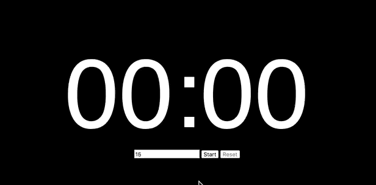

# Timer for TED presenter

Counter timer, which were used at TEDxAizuwakamatsu

https://nwtgck.github.io/ted-timer/

## Specifications

* Input unint is minute
* Click <kbd>Start</kbd> button to start countdown and hide input form
* Click the counter to show the input form again
* Click <kbd>Reset</kbd> button to reset and stop the countdown
* Turn the font color into red when the time has passed (NOTE: no sound at 00:00)

